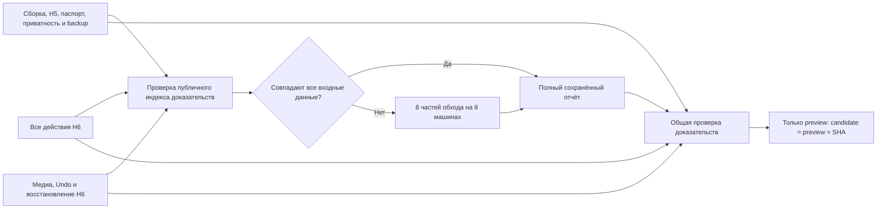

# Повторяемые проверки preview

Полный выпуск больше не является одним job. Сборка и статические проверки, обход H6 и приёмка медиа/восстановления выполняются независимо. Ошибка отдельного job позволяет повторить его через GitHub **Re-run failed jobs**, сохранив результаты успешных jobs того же коммита.

Публичный отчёт переиспользуется между коммитами только при одновременном совпадении:

- всех файлов опубликованной сборки, их числа и общего размера;
- фактического графа импортов теста, его помощников и проверяющего контракта;
- `package.json`, lockfile, списка маршрутов и `base`;
- Node, ОС/образа runner и версии настоящего Chromium, полученной через CDP.

Зависимости теста обходятся по AST. Неучтённый динамический импорт запрещает переиспользование. Изменение самостоятельного помощника H6 не сбрасывает публичный отчёт. Изменение используемого публичным тестом файла — сбрасывает.

Старый SHA и все исходные результаты в отчёте остаются неизменными. Отдельная квитанция связывает проверенный SHA с текущим выпуском и содержит контрольную сумму отчёта и входных данных. Обычные проверки полноты, ошибок, клавиатуры, галерей, no-JS, изоляции и всей сборки выполняются и для восстановленного отчёта. Повреждённые, неполные, неуспешные отчёты и грязные исходники не подходят для кэша.

Восемь частей обхода запускаются на отдельных GitHub runners после более коротких проверок. Каждая часть проверяет входной fingerprint до начала браузерного обхода. Слияние требует полный набор без повторов и пропусков. Пороговые значения, действия и маршруты сохранены.

Артефакты сохраняются сразу после этапа на 14 дней. Неуспешные H6-процессы также оставляют свой диагностический JSON. Успешный полный публичный отчёт сохраняется в Actions cache по точному fingerprint, без приближённых `restore-keys`. Проверки перед загрузкой Pages и непосредственно перед deploy по-прежнему требуют совпадения candidate, preview и проверяемого SHA. Main и production не публикуются.

До этого изменения успешный публичный обход в запуске `34451196774` не выгрузил JSON до последующего сбоя H6. Его журнал сохранён, но он не подменяет полный отчёт для кэша. Новая схема требует один первоначальный полный проход; последующие одинаковые публичные артефакты могут использовать его результат.

Первый полный проход восьми runners в `34471843738` успешно проверил 222 сочетания страницы/размера и 111 страниц без JS. Вместе с подготовкой runners он занял 20 минут 7 секунд; прежний четырёхчастный обход на одной машине — 1 час 49 минут 15 секунд. На объединении обнаружилось прежнее требование одинаковых времён файлов. Теперь каждая часть обязана подтвердить собственную свежесть и порядок времён; число файлов, их хеши и все остальные признаки сборки по-прежнему совпадают строго. Индивидуальные значения времени сохранены в итоговом отчёте.

Чтобы исправление сборщика отчётов не заставляло повторять уже успешную браузерную работу, существующий workflow поддерживает `resume_evidence_run`. Этот режим получает проверенную сборку и все исходные отчёты из указанного завершённого preview-run. Он требует успешные build, оба H6-job и все восемь публичных частей, а также неизменный candidate = preview = исходный SHA. Изменение публичного кода, данных или зависимостей в ветке инструмента запрещено. Новое объединение сохраняет SHA исходной проверки, контрольные суммы неизменных частей и отдельный SHA инструмента объединения. Полный старый проверяющий контракт запускается из чистого checkout исходного коммита; заново сверяются сборка, фактический Chromium/Node и fingerprint теста. Перед загрузкой и деплоем повторяется защита точных refs. Main и production остаются отключены.

В этом режиме публикуется именно ранее проверенный SHA сайта. Коммит исправления CI может находиться в рабочей ветке: он не выдаётся за повторно проверенную новую версию публичной части. Повторяются только объединение доказательств и выпуск; исходные браузерные jobs не запускаются.

Дополнительная сверка настоящих отчётов обнаружила 23 старых SVG (16 145 байт), которые checkout возвращал в `dist` при распаковке поверх отслеживаемых файлов. Все прежние файлы сборки остались побайтно прежними. Обычный процесс теперь переносит исходный `dist` в игнорируемый runtime и распаковывает артефакт в пустое место, сохраняя старые файлы для диагностики. Для уже выполненного обхода режим продолжения сохраняет точные просмотренные байты. Он принимает такие добавления только при совпадении с исходными отслеживаемыми SVG, повторяет H5, паспорт маршрутов и проверку приватности на этом же артефакте; старые отчёты сохраняются отдельно. Полный публичный обход, действия редактора и приёмка не повторяются.

Сверка сырого навигатора теперь сравнивает отсортированные копии списков с сохранением количества элементов: порядок DOM отличается от порядка маршрутов в модели. Исходные списки не изменяются; дубли, пропуски и неизвестные неопубликованные маршруты всё ещё запрещены. Исправленный контракт сверки запускается из ветки инструмента с корнем, SHA и контентом исходного checkout. Версия инструмента отдельно записана в отчёте.
