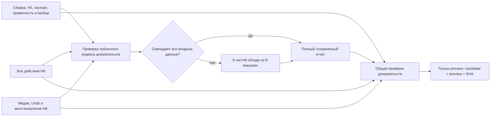

# Повторяемые проверки preview

Полный выпуск больше не является одним job. Сборка и статические проверки, обход H6 и приёмка медиа/восстановления выполняются независимо. Ошибка отдельного job позволяет повторить его через GitHub **Re-run failed jobs**, сохранив результаты успешных jobs того же коммита.

Публичный отчёт переиспользуется между коммитами только при одновременном совпадении:

- всех файлов опубликованной сборки, их числа и общего размера;
- фактического графа импортов теста, его помощников и проверяющего контракта;
- `package.json`, lockfile, списка маршрутов и `base`;
- Node, ОС/образа runner и версии настоящего Chromium, полученной через CDP.

Зависимости теста обходятся по AST. Неучтённый динамический импорт запрещает переиспользование. Изменение самостоятельного помощника H6 не сбрасывает публичный отчёт. Изменение используемого публичным тестом файла — сбрасывает.

Старый SHA и все исходные результаты в отчёте остаются неизменными. Отдельная квитанция связывает проверенный SHA с текущим выпуском и содержит контрольную сумму отчёта и входных данных. Обычные проверки полноты, ошибок, клавиатуры, галерей, no-JS, изоляции и всей сборки выполняются и для восстановленного отчёта. Повреждённые, неполные, неуспешные отчёты и грязные исходники не подходят для кэша.

Восемь частей обхода запускаются на отдельных GitHub runners после более коротких проверок. Каждая часть проверяет входной fingerprint до начала браузерного обхода. Слияние требует полный набор без повторов и пропусков. Пороговые значения, действия и маршруты сохранены.

Артефакты сохраняются сразу после этапа на 14 дней. Неуспешные H6-процессы также оставляют свой диагностический JSON. Успешный полный публичный отчёт сохраняется в Actions cache по точному fingerprint, без приближённых `restore-keys`. Проверки перед загрузкой Pages и непосредственно перед deploy по-прежнему требуют совпадения candidate, preview и проверяемого SHA. Main и production не публикуются.

До этого изменения успешный публичный обход в запуске `34451196774` не выгрузил JSON до последующего сбоя H6. Его журнал сохранён, но он не подменяет полный отчёт для кэша. Новая схема требует один первоначальный полный проход; последующие одинаковые публичные артефакты могут использовать его результат.
